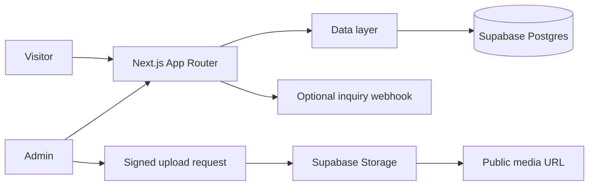

# Architecture

```mermaid
flowchart LR
  Visitor --> Next[Next.js App Router]
  Admin --> Next
  Next --> DB[Data layer]
  DB --> Supabase[(Supabase Postgres)]
  Admin --> Signed[Signed upload request]
  Signed --> Storage[Supabase Storage]
  Storage --> Media[Public media URL]
  Next --> Webhook[Optional inquiry webhook]
```

All application code imports data functions from `lib/db.js`. That module selects either the local file driver or Supabase driver. Browser code never receives the service-role key.
